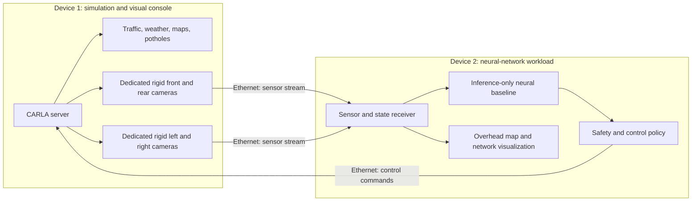

# Two-device autonomous-driving architecture

Device 1 remains responsible for simulation truth and rendering. Device 2
performs inference and can display the overhead map. Training remains disabled
until a reviewed dataset and evaluation plan are available. The safety layer
must remain active even when the neural network is remote.
